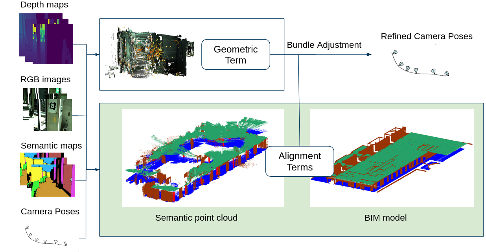

# BIMCaP

This repository contains an modified implementation of Floorplan-Aware Camera Poses Refinement paper, which was presented on 
IROS 2022. 

> **Floorplan-Aware Camera Poses Refinement**<br>
> [Anna Sokolova](https://scholar.google.ru/citations?hl=en&user=0Pcv9G4AAAAJ),
> [Filipp Nikitin](https://scholar.google.com/citations?user=DOljaG8AAAAJ&hl=en),
> [Anna Vorontsova](https://github.com/highrut),
> [Anton Konushin](https://scholar.google.com/citations?user=ZT_k-wMAAAAJ)
> <br>
> Samsung Research <br>
> https://arxiv.org/abs/2210.04572

## Introduction

This paper introduces a method conceived to overcome the challenge of integrating mobile 3D sparse LiDAR data and camera measurements with pre-existing building information models (BIM models). This enhancement is crucial for fast and accurate mapping conducted with affordable sensors within indoor environments. 
Our proposed framework, termed BIMCaP, presents a novel approach for automatic sensor pose refinement, leveraging a reference 3D BIM model. 
Central to our methodology is the application of a bundle adjustment technique, which seamlessly aligns semantically enhanced measurements from the real world with a BIM model. 
Through experimentation on real-world open-access data, we demonstrate the superior accuracy of our framework, surpassing current state-of-the-art methods. 
BIMCaP holds significant promise for enhancing the efficiency and cost-effectiveness of 3D mapping methodologies. 
This advancement carries substantial advantages across various domains, such as in construction site management and emergency response, where up-to-date digital maps facilitate better decision-making and enhanced productivity.



We enhance the original FACaP pipeline shown above by leveraging a BIM-model.


## Installation

We recommend using `Dockerfile` to build a container for the project. 
All required libraries are described in the environment file `env.yaml`. In the final version
we drop all of the `pytorch3d` dependencies, so you do not have to install it. 

## Data structure
All scans should be preprocessed to the next structure:
```
scan
│   floorplan.npy
|   floorplane.ply
|   ceiling.ply
│   
└───db
│   └───sparse
│       └───0
|           |   cameras.bin
|           |   images.bin
|           |   points3D.bin
│
└───arcore
│   │   cam_params.txt
│   │   ...
│   │   depth-0001.png
│   │   ...
│   │   frame-0001.png
│   │   ...
│   │   pose-0001.txt
│   │   ...
│   │
│
└───segmentation
│   │   frame-0001_wall.png
│   │   ...
│   │   frame-0001_floor.png
│   │   ...
│   │   frame-0001_ceiling.png
│   │   ...
│   │   frame-0001_columns.png
│  

```

Here:
- `floorplan.npy` is an array with the shape `n x 4`. Each element is a segment of the floorplan.
- `floorplane.ply` is a pointcloud of the floor in the BIM model.
- `ceiling.ply` is a pointcloud of the ceiling in the BIM model.
- `db` features a database in COLMAP format, which is used to map covisible points. 
- `cam_params.txt` intrinsics of the corresponding camera (w, h, f1, f1, p1, p2).
- `pose-0001.txt` extrinsic matrix of the corresponding camera
- `depth-0001.npy` depth map
- `frame-0001.png` RGB frame
- `frame-0001_wall.png` mask of walls for the corresponding frame
- `frame-0001_floor.png` mask of the floor for the corresponding frame
- `frame-0001_ceiling.png` mask of the ceiling for the corresponding frame
- `frame-0001_columns.png` rotated mask of the columns for the corresponding frame


For more details please see the file `facap/data/scan.py`.

## Usage

To run an experiment you should create a config file run experiment. 

```python
    python scripts/run_experimnt.py --config path_to_config --device "cuda:0"
```

The example of the config can be found in the path `experiments/config.yaml`.

## Citation

### Citation

If you find this work useful for your research, please cite the FACaP paper:
```
@INPROCEEDINGS{9981148,
  author={Sokolova, Anna and Nikitin, Filipp and Vorontsova, Anna and Konushin, Anton},
  booktitle={2022 IEEE/RSJ International Conference on Intelligent Robots and Systems (IROS)}, 
  title={Floorplan-Aware Camera Poses Refinement}, 
  year={2022},
  volume={},
  number={},
  pages={4857-4864},
  doi={10.1109/IROS47612.2022.9981148}}
```
